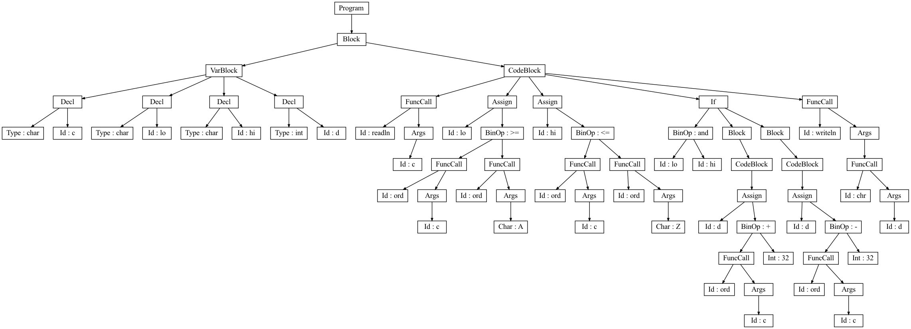

# cnake
This tool takes a [Pascal source file](pas/), does the following: <br/>
<ul>
<li>Lexical analysis</li>
<li>Creates a Parsing Tree</li>
<li>Semantic analysis</li>
<li>Translates to [output.c](https://github.com/pvodopija/cnake/blob/master/output.c)</li>
<li>Finally, runs the program</li>


## How to run?
Simply do ```python3 init.py input.pas output.c```. It will also generate a ```graph.png``` file showing the Parse Tree that looks like this:<br/><br/>

